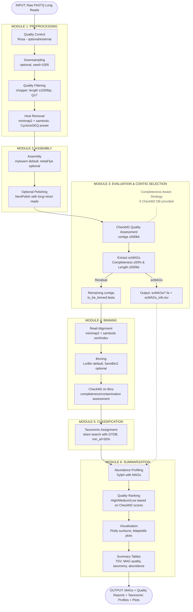

# CycMetaAsm

## Long-read Metagenomic Assembly and MAG Analysis Toolkit

**Version:** 1.1.0.0
**Software Type:** Bioinformatics pipeline for metagenomic analysis  
**Target Platform:** CycloneSEQ long-read sequencing platform

---

## A) Product Overview

### 1.1 Overview

CycMetaAsm is a comprehensive bioinformatics pipeline designed for processing long-read metagenomic sequencing data from the CycloneSEQ platform. It automates the complete workflow from raw data quality control through metagenome assembly, binning, and taxonomic classification to generate high-quality Metagenome-Assembled Genomes (MAGs) with taxonomic annotations and abundance profiles.

**Target Users:**

- Bioinformatics researchers working with metagenomic data
- Microbiome scientists analyzing complex microbial communities
- CycloneSEQ platform users requiring automated analysis pipelines

**Supported Data Types:**

- Long-read sequencing data (FASTQ/FASTQ.gz format)
  - CycloneSEQ native format (optimized)
  - PacBio HiFi reads
  - Oxford Nanopore reads
- Optional: Paired-end short reads for hybrid polishing (Illumina, FASTQ/FASTQ.gz)
- Input: Single-sample, single/multi-FASTQ files
- Gzip compression supported throughout

### 1.2 High-Level Pipeline Diagram



---

## B) Architecture & Module Decomposition

### Module List Table

| Module Name | Purpose | Inputs | Outputs | Key Parameters | External Tools/Libs | Key Code Entry Points |
|-------------|---------|--------|---------|----------------|---------------------|----------------------|
| **Preprocess** | Downsample, filter reads by quality/length, remove host contamination | FASTQ (long reads), optional host reference | Filtered FASTQ | `--downsample` (e.g., "10G"), `--min-length` (default: 1000), `--min-quality` (default: 7), `--threads`, `--sequencing-tech` | `chopper`, `minimap2`, `samtools`, `pigz` | `src/CycMetaAsm/cli.py::build_parser()`<br>`src/CycMetaAsm/pipelines/preprocess.py::run_preprocess()` |
| **Assembly** | Assemble metagenomic contigs using long reads; optional polishing with short reads | Cleaned FASTQ (long), optional short-read pair | `assembly.fasta`, `assembly_info.txt`, optional `genome.nextpolish.fasta` | `--assembler` (myloasm/metaflye), `--threads`, `--preset` (metaFlye only), `--polish`, `--short-reads1/2`, `--polish-path` | `myloasm`, `flye` (metaFlye), `nextPolish`, `fastp` | `src/CycMetaAsm/cli.py::build_parser()`<br>`src/CycMetaAsm/pipelines/assembly.py::AssemblyRunner.run()` |
| **Evaluation** | Assess contig completeness/contamination; extract high-quality single-contig MAGs | Assembly FASTA, CheckM2 DB | CheckM2 quality reports, scMAGs (if ≥93% complete & ≥500kb), `to_be_binned.fasta` | `--checkm2-db` (path to CheckM2 database), `--subset-path`, `--threads` | `checkm2` | `src/CycMetaAsm/cli.py::build_parser()` (completeness-aware logic)<br>`src/CycMetaAsm/pipelines/evaluation.py::ContigAnalyzer` |
| **Binning** | Cluster contigs into genome bins via coverage/composition | Assembly FASTA, cleaned reads FASTQ | Bins directory (`output_bins/*.fa`), `aligned.bam`, CheckM2 bin quality report | `--binner` (lorbin/semibin2), `--binning-model` (SemiBin2 only), `--sequencing-tech`, `--checkm2-db`, `--threads` | `minimap2`, `samtools`, `LorBin`, `SemiBin2`, `checkm2` | `src/CycMetaAsm/cli.py::build_parser()`<br>`src/CycMetaAsm/pipelines/binning.py::run_binning()` |
| **Classify** | Assign taxonomy to bins/MAGs using reference genomes | Bins directory, skani database, GTDB metadata TSV | `classify_result.tsv`, `classify_result_deduplicated.tsv` | `--tool` (skani), `--database`, `--metadata`, `--ass2ref` (default: 0.5), `--threads` | `skani` | `src/CycMetaAsm/cli.py::build_parser()`<br>`src/CycMetaAsm/pipelines/classify.py::Classifier.run()` |
| **Summarize** | Aggregate quality, taxonomy, abundance; generate plots and ranked tables | CheckM2 quality report TSV, optional classification TSV, MAGs directory, original FASTQ | Summary TSV, quality stats TSV, top-ranked MAG TSV, PNG plots, HTML sunburst | `--classification`, `--mag-path`, `--scmag-info`, `--fastq-file`, `--threads` | `sylph`, `pandas`, `matplotlib`, `seaborn`, `plotly` | `src/CycMetaAsm/cli.py::build_parser()`<br>`src/CycMetaAsm/pipelines/summary.py::process_files()` |
| **Utilities** | Shared helpers: checkpointing, command execution, preset settings | N/A | N/A | Sequencing tech presets (CycloneSEQ, HiFi, NanoPore) | N/A | `src/CycMetaAsm/utils.py::run_cmd()`, `::checkpoint()`, `::preset_setting()` |

### Module Interface Description

#### CLI Entry Point
- **Command:** `cycmetaasm`
- **Package:** `CycMetaAsm` (installed via `pip install -e .` or compiled with Nuitka)
- **Entry:** `src/CycMetaAsm/cli.py::main()` (also `src/CycMetaAsm/__main__.py`)

#### Common CLI Options (Global)
- `--log-level` (default: INFO): Logging verbosity

#### Subcommands

1. **`cycmetaasm preprocess`**
   - Positional: `input` (FASTQ path), `output` (output directory)
   - Options: `--threads`, `--downsample`, `--min-length`, `--min-quality`, `--host-reference`, `--sequencing-tech`

2. **`cycmetaasm assemble`**
   - Positional: `input` (FASTQ), `output` (directory)
   - Options: `--assembler`, `--threads`, `--preset`, `--polish`, `--polish-path`, `--short-reads1`, `--short-reads2`, `--checkm2-db`, `--subset-path`

3. **`cycmetaasm evaluate`** (standalone contig evaluation)
   - Positional: `assembly` (FASTA), `output` (directory)
   - Options: `--assembler`, `--threads`, `--assembly-info`, `--checkm2`, `--database`, `--metaquast`, `--reference`

4. **`cycmetaasm bin`**
   - Positional: `assembly` (FASTA), `reads` (FASTQ), `output` (directory)
   - Options: `--assembler`, `--binner`, `--threads`, `--binning-model`, `--sequencing-tech`, `--checkm2-db`

5. **`cycmetaasm classify`**
   - Positional: `bins` (directory), `output` (directory)
   - Options: `--database`, `--metadata`, `--assembler`, `--threads`, `--tool`, `--ass2ref`

6. **`cycmetaasm summarize`**
   - Positional: `bins_quality_report` (TSV), `output` (directory)
   - Options: `--threads`, `--classification`, `--mag-path`, `--scmag-info`, `--fastq-file`

#### Configuration
- No external YAML/JSON config files required; all parameters passed via CLI
- Sequencing technology presets embedded in `src/CycMetaAsm/utils.py::preset_setting()`

#### Environment Variables
- `MPLCONFIGDIR`, `XDG_CACHE_HOME`, `FONTCONFIG_PATH`, `FONTCONFIG_FILE` (set in Dockerfile for matplotlib/fontconfig in containerized runs)

---

## C) Algorithm & Pipeline Details

### MODULE 1: Preprocessing (`preprocess`)

**Entry:** `src/CycMetaAsm/pipelines/preprocess.py::run_preprocess()`

#### Step-by-Step Pipeline

1. **Downsampling (Optional)**
   - **Condition:** If `--downsample` provided (e.g., "10G" → 10×10⁹ bases)
   - **Algorithm:** 
     - Parse input FASTQ; compute cumulative base counts
     - Shuffle read indices (seed=1005)
     - Accumulate reads until target bases reached
   - **Implementation:** `preprocess.py::FastqDownsampler`
   - **Output:** `<output>/downsampled.fastq.gz`
   - **Tool:** `pigz` for compression (`-p <threads>`)

2. **Quality Filtering**
   - **Condition:** Always (if `--min-length` and `--min-quality` set)
   - **External Tool:** `chopper`
   - **Command Template:**
     ```bash
     chopper -i <fastq> --minlength <min_length> --quality <min_quality> -t <threads> | pigz -p <threads> > filtered.fastq.gz
     ```
   - **Defaults:** `--min-length 1000`, `--min-quality 7`
   - **Output:** `<output>/qc/filtered.fastq.gz`

3. **Host Removal (Optional)**
   - **Condition:** If `--host-reference` provided
   - **External Tools:** `minimap2`, `samtools`
   - **Command Pipeline:**
     ```bash
     minimap2 <preset> -t <threads> <host_ref> <fastq> | 
     samtools view -@ <threads> -f 4 -b | 
     samtools fastq -@ <threads> | 
     pigz -p <threads> > host_removed.fastq.gz
     ```
   - **Preset Selection (from `utils.py::preset_setting()`):**
     - CycloneSEQ: `-a -k 16 -w 13 -A 2 -B 4 -O 4,41 -E 2,1 -s 180 -U70,1000000 --eqx --secondary=no`
     - HiFi: `-ax map-hifi --eqx --secondary=no`
     - NanoPore: `-ax map-ont --eqx --secondary=no`
   - **Unmapped reads:** Extracted via `samtools view -f 4` (unmapped flag)
   - **Output:** `<output>/remove_host/host_removed.fastq.gz`

**Checkpoint Mechanism:**
- Each substep creates `_isDone` sentinel file upon completion
- Rerunning the same command skips completed steps

**Thresholds & Parameters:**
- Downsampling seed: `1005` (hardcoded in `FastqDownsampler`)
- Filter defaults: min_length=1000, min_quality=7 (Q-score)

---

### MODULE 2: Assembly (`assemble`)

**Entry:** `src/CycMetaAsm/pipelines/assembly.py::AssemblyRunner.run()`

#### Step-by-Step Pipeline

1. **Assembly (myloasm default; metaFlye compatibility mode)**
   - **External Tools:** `myloasm` by default; `flye` in metaFlye mode when `--assembler metaflye` is selected
   - **Command Templates:**
     ```bash
     myloasm <fastq> -o <output> -t <threads>
     flye <preset> <fastq> --out-dir <output> --threads <threads> --meta
     ```
   - **Preset:** `--preset` is silently ignored for `myloasm`; metaFlye uses `--nano-raw` for CycloneSEQ/NanoPore unless overridden
   - **Output Files:**
     - `<output>/assembly.fasta`: Assembled contigs
     - `<output>/assembly_info.txt`: Contig metadata when emitted by the assembler; myloasm falls back to FASTA headers
   - **Checkpoint:** `<output>/_isDone` prevents re-run

2. **Polishing (Optional, if `--polish` enabled)**

   **2.1 Short-Read QC (if `--short-reads1/2` provided)**
   - **External Tool:** `fastp`
   - **Command:**
     ```bash
     fastp -i <short_reads1> -o filter_1.fq.gz -I <short_reads2> -O filter_2.fq.gz \
           --n_base_limit 0 --thread <threads>
     ```
   - **Output:** `<polish_dir>/short_reads_qc/filter_{1,2}.fq.gz`
   - **Checkpoint:** `<polish_dir>/short_reads_qc/_isDone`

   **2.2 NextPolish Execution**
   - **External Tool:** `nextPolish`
   - **Configuration:** Auto-generated `run.cfg` written to `<polish_dir>/run.cfg`
   - **Key Settings:**
     ```ini
     [General]
     job_type = local
     task = best
     parallel_jobs = 6
     multithread_jobs = <threads>
     genome = <assembly.fasta>
     genome_size = auto
     workdir = <polish_dir>

     [sgs_option]  # If short reads provided
     sgs_fofn = sgs.fofn
     sgs_options = -max_depth 100 -bwa

     [lgs_option]  # Long reads (always)
     lgs_fofn = lgs.fofn
     lgs_options = -min_read_len 1000 -max_depth 100
     lgs_minimap2_options = -x map-ont
     ```
   - **Command:**
     ```bash
     nextPolish <run.cfg>
     ```
   - **Output:** `<polish_dir>/genome.nextpolish.fasta`
   - **Checkpoint:** `<polish_dir>/_isDone`

**Thresholds:**
- NextPolish min_read_len: 1000
- Max depth: 100 (both short and long)
- fastp n_base_limit: 0 (no ambiguous bases allowed)

**Assembly Info Parsing:**
- `assembly_info.txt` format (Flye-style table) or FASTA headers for assemblers without a separate info table:
  ```
  #seq_name  length  cov.  circ.
  contig_1   500000  50.5  Y
  ```
- Parsed by `utils.py::read_assembly_info()`

---

### MODULE 3: Evaluation & Completeness-Aware Strategy (`evaluate` / within `assemble`)

**Entry:** `src/CycMetaAsm/pipelines/evaluation.py::ContigAnalyzer`

#### Algorithm: Completeness-Aware Strategy

**Condition:** Triggered if `--checkm2-db` provided during `assemble` command

**Step-by-Step:**

1. **Identify Large Contigs**
   - Parse assembly FASTA
   - Filter: Length ≥ 500,000 bp
   - Write each qualifying contig to `<subset_path>/tmp/<contig_id>.fasta`

2. **CheckM2 Assessment**
   - **External Tool:** `checkm2`
   - **Command:**
     ```bash
     checkm2 predict --threads <threads> --input <tmp_dir> \
                     --output-directory <checkm2_output> --force --quiet \
                     --database_path <checkm2_db>
     ```
   - **Output:** `<checkm2_output>/quality_report.tsv`
     - Columns: `Name`, `Completeness`, `Contamination`, `Genome_Size`, etc.

3. **Extract scMAGs**
   - **Criteria:** Completeness ≥ 93% AND Length ≥ 500kb
   - **Action:**
     - Write each qualifying contig as `<subset_path>/scMAGs/<contig_id>.fa`
     - Generate `scMAGs_info.tsv` with columns: `Contig`, `Length`, `Completeness`, `Contamination`
   - **Non-qualifying contigs:** Written to `<subset_path>/to_be_binned.fasta`

**Metrics Definitions:**
- **Completeness (%):** CheckM2's estimate of genome completeness based on presence of single-copy marker genes (calculated by CheckM2 internal model)
- **Contamination (%):** Estimated contamination based on duplicated markers (CheckM2 internal)
- **N50:** Not computed here; available from metaQUAST (optional evaluation subcommand)

**Thresholds:**
- scMAG length cutoff: 500,000 bp
- scMAG completeness cutoff: 93%

---

### MODULE 4: Binning (`bin`)

**Entry:** `src/CycMetaAsm/pipelines/binning.py::run_binning()`

#### Step-by-Step Pipeline

1. **Read Alignment**
   - **External Tools:** `minimap2`, `samtools`
   - **Command:**
     ```bash
     minimap2 <preset> -t <threads> --sam-hit-only <assembly_fasta> <reads_fastq> | 
     samtools sort -@ <threads> -o aligned.bam
     samtools index aligned.bam
     ```
   - **Preset:** Same as preprocessing (CycloneSEQ default)
   - **Output:** `<output>/aligned.bam`, `aligned.bam.bai`

2. **Binning (LorBin default; SemiBin2 compatibility mode)**
   - **External Tools:** `LorBin` by default; `SemiBin2` when `--binner semibin2` is selected
   - **Command Templates:**
     ```bash
     LorBin bin --fasta <assembly_fasta> --output <output> \
       --num_process <threads> --bam <aligned.bam>

     SemiBin2 single_easy_bin \
       --random-seed 1005 \
       --sequencing-type=long_read \
       --environment <binning_model> \
       --compression none \
       --tmpdir <output>/tmp \
       -t <threads> \
       --input-fasta <assembly_fasta> \
       --input-bam <aligned.bam> \
       --output <output>
     ```
   - **Available SemiBin2 Models (--environment):**
      - `global` (default): General-purpose model
      - `human_gut`, `dog_gut`, `ocean`, `soil`, `cat_gut`, `human_oral`, `mouse_gut`, `pig_gut`, `built_environment`, `wastewater`, `chicken_caecum`
   - **Output:** `<output>/output_bins/*.fa` (one file per bin; LorBin outputs are standardized here)
   - **Checkpoint:** `<output>/_isDone`

3. **CheckM2 Bin Quality Assessment (Optional)**
   - **Condition:** If `--checkm2-db` provided
   - **Command:** (via `ContigAnalyzer.run_checkm2()`)
     ```bash
     checkm2 predict --threads <threads> --input <output_bins> \
                     -x fasta --output-directory <output>/checkm2 \
                     --force --quiet --database_path <checkm2_db>
     ```
   - **Output:** `<output>/checkm2/quality_report.tsv`

**Parameters:**
- Default binner: `lorbin`
- SemiBin2 compatibility mode: `--binner semibin2`
- SemiBin2 random seed: 1005
- Sequencing type: `long_read`
- Compression: `none` for SemiBin2 (output bins as plain FASTA)

---

### MODULE 5: Classification (`classify`)

**Entry:** `src/CycMetaAsm/pipelines/classify.py::Classifier.run()`

#### Algorithm: Taxonomic Classification with skani

**Step-by-Step:**

1. **Load GTDB Metadata**
   - **Input:** TSV file mapping accessions to taxonomy strings
   - **Format:** `<accession>\t<taxonomy>` (e.g., `GCA_000123456.1\td__Bacteria;p__Proteobacteria;...`)
   - **Caching:** MD5-based pickle cache (`<metadata>.pkl`) for fast re-loads
   - **Implementation:** `classify.py::Classifier._load_gtdb_metadata()`

2. **skani Search**
   - **External Tool:** `skani`
   - **Command:**
     ```bash
     skani search <bin1.fasta> <bin2.fasta> ... -d <skani_db> \
           -o results_file.txt -t <threads> --min-af 50 \
           --short-header --detailed
     ```
   - **Key Parameter:** `--min-af 50` (minimum alignment fraction: 50%, aligns with GTDB classification standards)
   - **Output:** `results_file.txt` (TSV with columns: `Query_file`, `Ref_file`, `ANI`, `Num_query_contigs`, etc.)

3. **Parse and Annotate Results**
   - Extract accession from `Ref_file` (e.g., `GCA_000123456.1` from filename)
   - Map to GTDB taxonomy string
   - Parse taxonomy into levels: Domain, Phylum, Class, Order, Family, Genus, Species
     - Format: `d__<Domain>;p__<Phylum>;c__<Class>;...`
   - **ANI (Average Nucleotide Identity):** Directly from skani output (percentage)

4. **Deduplication**
   - Keep best hit per MAG (highest ANI)
   - skani already returns sorted results by ANI (descending)
   - **Implementation:** `pandas.DataFrame.drop_duplicates("MAG_ID", keep="first")`

**Output Files:**
- `classify_result.tsv`: All hits
- `classify_result_deduplicated.tsv`: Best hit per MAG

**Output Columns:**
- `Reference`, `MAG_ID`, `ANI`, `Num_contigs`, `Taxonomy`, `Domain`, `Phylum`, `Class`, `Order`, `Family`, `Genus`, `Species`

**Thresholds:**
- Minimum alignment fraction: 50% (skani `--min-af`)

---

### MODULE 6: Summarization (`summarize`)

**Entry:** `src/CycMetaAsm/pipelines/summary.py::process_files()`

#### Step-by-Step Pipeline

1. **Merge Quality & Classification Data**
   - Load CheckM2 quality report TSV
   - Merge with classification results (if provided)
   - Include scMAG info (if provided)
   - **Output Columns:** `MAG_ID`, `Completeness`, `Contamination`, `Contig_N50`, `Total_Contigs`, `Genome_Size`, `Reference`, `ANI`, `Taxonomy`, taxonomic levels

2. **Rank MAGs by Quality**
   - **Algorithm (from `summary.py::_rank_mag_by_quality()`):**
     - **High Quality:** Completeness ≥90% AND Contamination ≤5%
     - **Medium Quality:** Completeness ≥50% AND Contamination ≤10%
     - **Low Quality:** 
       - Quality Score < 50, where `Quality_Score = Completeness - 5 × Contamination`
       - OR Total_Contigs > 2000
   - **Output:** New column `Quality_rank` (High/Medium/Low)

3. **Abundance Profiling (Optional)**
   - **Condition:** If `--mag-path` and `--fastq-file` provided
   - **External Tool:** `sylph`
   - **Steps:**
     a. Create MAG file list (one line per MAG FASTA)
     b. **Sketch MAGs:**
        ```bash
        sylph sketch -l <mag_file_list> -c 200 -t <threads> -o sylph_mag_sketch
        ```
     c. **Profile Abundance:**
        ```bash
        sylph profile sylph_mag_sketch.syldb <fastq_file> -c 200 -t <threads> -o sylph_classification.tsv
        ```
   - **Output Columns:** `MAG_ID`, `Taxonomic_abundance(%)`, `Sequence_abundance(%)`

4. **Copy MAGs by Quality**
   - High/Medium quality MAGs → `<outdir>/passed_quality_mags/`
   - Low quality MAGs → `<outdir>/low_quality_mags/`

5. **Generate Visualizations**

   **5.1 Quality Stats Table (`quality_stats.tsv`)**
   - Single-row TSV with counts and total genome sizes:
     - `High_MAGs`, `Medium_MAGs`, `All_MAGs`, `High_Genome_Size`, `Medium_Genome_Size`, `All_Genome_Size`

   **5.2 Completeness/Contamination Rank Plots (`rank_completeness_contamination.png`)**
   - Two-panel matplotlib figure:
     - Left: Completeness vs. Rank (descending completeness)
     - Right: Contamination vs. Rank (ascending contamination)
   - Filters: Excludes Low-quality MAGs

   **5.3 Contig N50 Violin Plot (`contig_n50_violin.png`)**
   - Seaborn violin plot of N50 distribution (in Mbp) for non-Low-quality MAGs

   **5.4 Taxonomic Abundance Sunburst (Optional, `taxonomic_abundance.html`)**
   - **Condition:** If classification and abundance data available
   - **Tool:** Plotly interactive HTML
   - **Hierarchy:** Domain → Phylum → Class → Order → Family → Genus → Species
   - **Filter:** min_abundance=0.01% (1e-4)

6. **Generate Summary Tables**
   - **`summary.tsv`:** All MAGs with all columns
   - **`top_ranked_mag_summary.tsv`:** Top 20 High/Medium quality MAGs sorted by Quality_Score (descending)

**Metrics & Formulas:**
- **Quality_Score:** `Completeness - 5 × Contamination` (for ranking within High/Medium tiers)
- **N50 (Contig_N50):** From CheckM2 output (computed by CheckM2 internally)
- **Taxonomic_abundance(%):** From sylph (relative abundance based on sequence similarity)
- **Sequence_abundance(%):** From sylph (raw sequencing depth abundance)

---

## D) Installation & Reproducibility

### D.1 Dependencies

**Python Version:** ≥3.12 (as specified in `pyproject.toml`)

**Conda Environment:** Recommended for reproducibility  
See `environment.yml` for full dependency list.

**Key External Tools (installed via conda):**
- `myloasm` ≥0.5 (default assembly)
- `flye` ≥2.9 (metaFlye assembly)
- `nextpolish` ≥1.4.1 (polishing)
- `minimap2` ≥2.2 (alignment)
- `samtools` ≥1.14 (BAM processing)
- `chopper` (read filtering, Rust-based)
- `fastp` (short-read QC)
- `pigz` ≥2.8 (parallel gzip)
- `LorBin` 0.1.0 (default binning; vendored in the Docker build)
- `SemiBin2` ≥2.2 (compatibility binning)
- `checkm2` (quality assessment)
- `skani` ≥0.3 (taxonomic classification)
- `sylph` ≥0.8.1 (abundance profiling)
- `quast` ≥5.2.0 (optional, for metaQUAST evaluation)
- `rosa` 1.1.0 (WDL read QC report generation; vendored wheel in Docker build)
- `cycloneseq-report` (WDL final HTML report generation; installed from a BuildKit named context)

**Python Libraries:**
- `biopython`, `pandas`, `numpy`, `matplotlib`, `seaborn`, `plotly`

### D.2 Installation Steps

**Option 1: Conda + Pip (Development)**

```bash
# 1. Create conda environment
conda env create -f environment.yml
conda activate metagenome_assembly

# 2. Install CycMetaAsm Python package (editable mode)
pip install --upgrade pip
pip install -e .

# 3. Verify installation
cycmetaasm --help
```

**Option 2: Docker (Production)**

```bash
# 1. Build Docker image (uses pre-compiled Nuitka binary)
DOCKER_BUILDKIT=1 docker build \
  --build-context cycloneseq_report_template=/data/gukaijie/project/00.review/cycloneseq-report-template \
  -t cycmetaasm:v1.1.0 \
  .

# 2. Run container
docker run --rm -v $(pwd)/data:/data cycmetaasm:v1.1.0 cycmetaasm --help
docker run --rm cycmetaasm:v1.1.0 rosa --help
docker run --rm cycmetaasm:v1.1.0 cycloneseq-report -h
```

**Option 3: Standalone Binary (Nuitka Compilation)**

```bash
# On host machine with conda environment activated
pip install --upgrade pip nuitka
pip install -e .

# Compile to standalone binary
python -m nuitka \
  --onefile \
  --standalone \
  --include-package=CycMetaAsm \
  --include-package=plotly \
  --include-package-data=plotly \
  --output-dir=build \
  src/CycMetaAsm

# Binary will be at: build/CycMetaAsm.bin
# Copy to system path: sudo cp build/CycMetaAsm.bin /usr/local/bin/cycmetaasm
```

### D.3 Databases Required

**CheckM2 Database:**
- Download: `checkm2 database --download --path <db_path>`
- Required for MAG quality assessment
- File: `uniref100.KO.1.dmnd` (typically ~4GB)

**skani GTDB Database:**
- Pre-built GTDB sketch database for `skani search`
- Required for taxonomic classification
- Companion metadata file: `<database>_metadata.tsv` (accession → taxonomy mapping)

**Host Reference (Optional):**
- For host removal, e.g., `GRCh38.p14.fa` (human genome)
- Any FASTA-formatted reference genome

### D.4 Determinism & Reproducibility

**Random Seeds:**
- Downsampling: `seed=1005` (hardcoded in `FastqDownsampler.__init__()`)
- SemiBin2 binning compatibility mode: `--random-seed 1005` (hardcoded in binning command)

**Version Pinning:**
- Use `conda-linux-64.lock` for the main environment, `lorbin-conda-linux-64.lock` for LorBin, `rosa-bio-linux-64.lock` for Rosa, and the `cycloneseq-report` template lock from the named Docker build context
- Lock files ensure reproducible package versions across environments

**Tool Presets:**
- Sequencing technology presets defined in `src/CycMetaAsm/utils.py::preset_setting()`
- CycloneSEQ minimap2 preset: `-a -k 16 -w 13 -A 2 -B 4 -O 4,41 -E 2,1 -s 180 -U70,1000000 --eqx --secondary=no`
- myloasm default: no assembler preset is used
- metaFlye compatibility preset: `--nano-raw` (for CycloneSEQ/NanoPore)

**Checkpoint System:**
- All modules support checkpoint files (`_isDone`)
- Re-running commands skips completed steps, ensuring consistency

---

## E) I/O Specification & Directory Structure

### E.1 Input File Expectations

**FASTQ Naming Conventions:**
- Extensions: `.fastq`, `.fastq.gz`, `.fq`, `.fq.gz`
- Single or gzip-compressed supported
- Validation: `utils.py::is_fastq_file()`

**Paired-End Short Reads (Optional):**
- Must provide both `--short-reads1` and `--short-reads2`
- Standard Illumina naming (e.g., `lib_1.fq.gz`, `lib_2.fq.gz`)

**Sample Sheet Format:** Not required; single-sample mode only

**FASTA (Assembly) Inputs:**
- Extensions: `.fasta`, `.fasta.gz`, `.fa`, `.fa.gz`
- Validation: `utils.py::is_fasta_file()`

### E.2 Output Directory Tree

```
<output_root>/
├── downsampled.fastq.gz              # If downsample enabled
├── _isDone                           # Checkpoint file
├── qc/
│   ├── filtered.fastq.gz             # Filtered reads
│   └── _isDone
├── remove_host/
│   ├── host_removed.fastq.gz         # Host-depleted reads
│   └── _isDone
├── assembly.fasta                    # Assembly contigs
├── assembly_info.txt                 # Contig metadata or FASTA-header fallback
├── _isDone
├── polish/                           # If --polish enabled
│   ├── short_reads_qc/
│   │   ├── filter_1.fq.gz
│   │   ├── filter_2.fq.gz
│   │   └── _isDone
│   ├── lgs.fofn                      # Long-read file list
│   ├── sgs.fofn                      # Short-read file list (if provided)
│   ├── run.cfg                       # NextPolish config
│   ├── genome.nextpolish.fasta       # Polished assembly
│   └── _isDone
├── subset_contigs/                   # If --checkm2-db enabled
│   ├── tmp/                          # Temp contig files for CheckM2
│   ├── checkm2/
│   │   ├── quality_report.tsv
│   │   └── _isDone
│   ├── scMAGs/
│   │   ├── <contig_id>.fa            # High-quality single-contig MAGs
│   │   └── scMAGs_info.tsv           # MAG metadata
│   └── to_be_binned.fasta            # Remaining contigs for binning
├── <binning_output>/
│   ├── aligned.bam                   # Read alignments
│   ├── aligned.bam.bai
│   ├── output_bins/
│   │   └── *.fa                      # Bins
│   ├── checkm2/
│   │   ├── quality_report.tsv
│   │   └── _isDone
│   ├── tmp/                          # Binner temp files, if produced
│   └── _isDone
├── <classify_output>/
│   ├── results_file.txt              # skani raw output
│   ├── classify_result.tsv           # Full classification
│   ├── classify_result_deduplicated.tsv
│   └── _isDone
└── <summary_output>/
    ├── tmp/
    │   ├── mag_file_list.txt
    │   ├── sylph_mag_sketch.syldb
    │   └── sylph_classification.tsv
    ├── passed_quality_mags/
    │   └── *.fa
    ├── low_quality_mags/
    │   └── *.fa
    ├── summary.tsv                   # All MAGs summary
    ├── top_ranked_mag_summary.tsv    # Top 20 MAGs
    ├── quality_stats.tsv             # Count & size stats
    ├── rank_completeness_contamination.png
    ├── contig_n50_violin.png
    └── taxonomic_abundance.html      # Interactive sunburst (if classification available)
```

### E.3 Key Output File Formats

**`assembly_info.txt` (Flye-style table; myloasm may use FASTA-header fallback):**
```
#seq_name   length   cov.    circ.
contig_1    1000000  45.2    Y
contig_2    500000   30.1    N
```

**`scMAGs_info.tsv`:**
```
Contig          Length    Completeness  Contamination
contig_large_1  1200000   95.5          1.2
contig_large_2  800000    94.0          0.8
```

**`checkm2/quality_report.tsv`:**
```
Name         Completeness  Contamination  Genome_Size  Contig_N50  Total_Contigs
bin.1        92.5          2.1            3000000      150000      5
bin.2        85.0          4.5            2500000      100000      8
```

**`classify_result_deduplicated.tsv`:**
```
Reference        MAG_ID  ANI   Num_contigs  Taxonomy                    Domain    Phylum           Class            ...
GCA_000123456.1  bin.1   98.5  5            d__Bacteria;p__Proteo...   Bacteria  Proteobacteria   Gammaproteobac...
GCA_000789012.1  bin.2   97.2  8            d__Bacteria;p__Firmicu...  Bacteria  Firmicutes       Bacilli          ...
```

**`summary.tsv`:**
```
MAG ID  Quality rank  Completeness  Contamination  Total Contigs  Genome Size  Contig N50  Reference        ANI   Taxonomic abundance(%)  Species         ...
bin.1   High          92.5          2.1            5              3000000      150000      GCA_000123456.1  98.5  15.3                    Species_name
```

### E.4 Logging

**Log Files:** No dedicated log files; logs written to stdout/stderr

**Verbosity Levels:** Controlled via `--log-level` (DEBUG, INFO, WARNING, ERROR, CRITICAL)

**Progress Reporting:**
- Each external tool command logged via `utils.py::run_cmd()` (logs command line)
- Checkpointing messages logged on `_isDone` creation

### E.5 Error Handling

**Exit Codes:**
- 0: Success
- Non-zero: Failure (from `subprocess.CalledProcessError` if external tool fails)

**Common Failure Modes (detectable from code):**
- Missing input files: `FileNotFoundError` in CLI argument validation
- Unsupported file format: `parser.error()` in `cli.py`
- Tool execution failure: `subprocess.CalledProcessError` with stderr logged
- Empty bins directory: `FileNotFoundError` in `classify.py::Classifier._run_skani()`

**Validation:**
- FASTQ/FASTA format validation via extension checking (`utils.py::is_fastq_file()`, `is_fasta_file()`)
- No deep schema validation; relies on external tools for format errors

---

## F) Performance & Scalability

### F.1 Parallelization Strategy

**Thread-Level Parallelism:**
- All external tools support multithreading via `--threads` / `-t` / `-@` parameters
- Default: 10 threads (user-configurable)

**Per-Sample Execution:**
- Single-sample mode only; no multi-sample parallelization built-in
- For batch processing, use external workflow managers (e.g., WDL, Snakemake)

**No Explicit Scatter/Gather:**
- Pipeline is sequential within a sample
- Binning/classification naturally parallelized by external tools (LorBin/SemiBin2, skani)

### F.2 Memory & Disk Considerations

**Memory-Intensive Steps:**
- Assembly (myloasm or metaFlye): ~30-100GB RAM depending on dataset size
- Binning (LorBin or SemiBin2): ~10-30GB RAM
- CheckM2: ~10-20GB RAM (model loading + prediction)

**Disk Space:**
- Temporary files: assembler intermediates, alignment BAMs, binner temp files
- Cleanup: binner temp directories can be deleted post-run when no longer needed
- Checkpointing reduces redundant I/O

**Streaming vs. Temp Files:**
- Preprocessing uses pipe chains (minimizes temp files)
- Assembly/binning write intermediate files (BAMs, bins) for reusability

### F.3 Scalability

**Dataset Size:**
- Tested on long-read datasets from 1-100GB (raw FASTQ)
- Downsampling recommended for >50GB to reduce assembly complexity

**Contig Count:**
- Binning handles assemblies with 1,000-10,000+ contigs
- Low-quality filter excludes bins with >2,000 contigs (likely fragmented)

### F.4 Container Considerations

**Dockerfile Optimizations:**
- Micromamba base for fast conda environment
- Pre-compiled Nuitka binary reduces startup time
- Separate locked environments isolate CycMetaAsm, LorBin, Rosa, and the report generator dependency stacks
- Docker builds require the `cycloneseq_report_template` BuildKit context for `cycloneseq-report`
- Writable cache directories for matplotlib (`MPLCONFIGDIR=/tmp/matplotlib`)

**No cgroup Limits Coded:**
- Resource limits should be imposed externally (Docker `--cpus`, `--memory` flags)

---

## G) Design-Doc Mapping

### Mapping README Sections to Design Document Chapters

| Design Doc Chapter | Content Source in README |
|--------------------|--------------------------|
| **Chapter 1: 目的 (Purpose)** | Section A.1.1 (Product Overview): Problem statement, integration/acceptance testing relevance (MAG quality validation, reproducibility) |
| **Chapter 2: 范围 (Scope)** | Section A.1.1 (Target Users, Supported Data Types): In-scope = CycloneSEQ long reads, single-sample MAG recovery; Out-of-scope = multi-sample joint analysis, short-read-only mode |
| **Chapter 3: 术语/缩略语 (Terms/Abbreviations)** | Throughout: MAG (Metagenome-Assembled Genome), scMAG (single-contig MAG), ANI (Average Nucleotide Identity), N50, GTDB (Genome Taxonomy Database), FASTQ/FASTA formats, CheckM2, LorBin, SemiBin2, skani, sylph, myloasm, metaFlye, NextPolish |
| **Chapter 4: 参考资料 (References)** | Section D.1 (Dependencies), D.3 (Databases): Tool documentation (myloasm, Flye, LorBin, SemiBin2, CheckM2, skani, sylph), GTDB database, GRCh38 reference genome |
| **Chapter 5: 详细设计描述 (Detailed Design)** | Section B (Architecture & Module Decomposition): Module list table, CLI interface description, configuration (no external files), sequencing tech presets |
| **Chapter 6: 算法设计描述 (Algorithm Design)** | Section C (Algorithm & Pipeline Details): Step-by-step pipelines, external tool commands with parameters, thresholds (length, quality, completeness, ANI), metric definitions (Quality_Score, ANI, abundance), example output tables |

### TBD Items (Requires Confirmation from Code or Additional Documentation)

1. **Front Matter Metadata (Chapter 0):**
   - 项目编号, 文件编号, 文件密级, 评审/签名记录表 → **TBD**: Not inferable from code; requires organizational metadata

2. **Integration Testing Details (Chapter 1):**
   - Specific acceptance criteria and production validation datasets → **TBD**: focused regression checks are under `test/`, while existing historical scripts remain under `tests/`

3. **Version History / 修订记录 (Chapter 0):**
   - Previous versions, change logs → **TBD**: Only version 0.1.0 in `pyproject.toml`; need formal revision tracking

4. **Rosa Tool (Preprocessing QC):**
   - Rosa is used by WDL-only QC tasks and installed in the production Docker image from the vendored release wheel

5. **Performance Benchmarks:**
   - Runtime, peak memory for reference datasets → **TBD**: Need empirical benchmark runs; not coded

6. **Error Code Taxonomy:**
   - Specific exit codes for different failure modes → **TBD**: Code raises generic exceptions; no custom error code system

7. **kMetaShot Classification:**
   - Deprecated code in `classify.py` → **TBD**: Confirm removal or document as unsupported legacy

---

## H) Technical Notes for Design Document Authors

### Code References for Validation

- **CLI Entry:** `src/CycMetaAsm/cli.py::build_parser()` defines all subcommands and parameters
- **Preset Settings:** `src/CycMetaAsm/utils.py::preset_setting()` (lines 225-249) contains sequencing tech mappings
- **Checkpoint Logic:** `src/CycMetaAsm/utils.py::checkpoint()`, `mark_done()` (lines 43-52)
- **Command Execution:** `src/CycMetaAsm/utils.py::run_cmd()` (lines 68-135) handles subprocess calls
- **Quality Ranking:** `src/CycMetaAsm/pipelines/summary.py::_rank_mag_by_quality()` (lines 358-386)
- **Completeness-Aware Logic:** `src/CycMetaAsm/cli.py` (lines 262-320) in `assemble` command handler

### External Tool Documentation Links

- **myloasm:** https://github.com/bluenote-1577/myloasm
- **Flye (metaFlye):** https://github.com/fenderglass/Flye
- **NextPolish:** https://github.com/Nextomics/NextPolish
- **LorBin:** https://github.com/morgannprice/LorBin
- **SemiBin2:** https://github.com/BigDataBiology/SemiBin
- **CheckM2:** https://github.com/chklovski/CheckM2
- **skani:** https://github.com/bluenote-1577/skani
- **sylph:** https://github.com/bluenote-1577/sylph
- **chopper:** https://github.com/wdecoster/chopper
- **minimap2:** https://github.com/lh3/minimap2
- **GTDB:** https://gtdb.ecogenomic.org/

### Acceptance Testing Recommendations

1. **Unit Tests:** Validate individual module outputs (e.g., filtered FASTQ read count, contig count)
2. **Integration Tests:** Run full pipeline on mock dataset (5-10GB); verify MAG count, quality distribution
3. **Regression Tests:** Compare output against baseline run with fixed seed (ensure determinism)
4. **Performance Tests:** Measure runtime and peak memory on standard dataset sizes (10GB, 50GB, 100GB)

---

## I) License

This project is licensed under the MIT License - see the [LICENSE](LICENSE) file for details.

---

## J) Appendix: Quick Reference

### Minimal Working Example

```bash
# 1. Preprocess
cycmetaasm preprocess raw_reads.fastq.gz output/ \
  --threads 40 --min-length 1000 --min-quality 7

# 2. Assemble with completeness-aware strategy
cycmetaasm assemble output/qc/filtered.fastq.gz output/ \
  --threads 40 --checkm2-db checkm2_db/uniref100.KO.1.dmnd

# 3. Bin remaining contigs
cycmetaasm bin output/subset_contigs/to_be_binned.fasta \
  output/qc/filtered.fastq.gz output/binning/ \
  --threads 40 --checkm2-db checkm2_db/uniref100.KO.1.dmnd

# 4. Classify bins
cycmetaasm classify output/binning/output_bins/ output/classify/ \
  --database skani_db/ --metadata gtdb_metadata.tsv --threads 40

# 5. Summarize all MAGs
cycmetaasm summarize output/binning/checkm2/quality_report.tsv output/summary/ \
  --classification output/classify/classify_result_deduplicated.tsv \
  --mag-path output/subset_contigs/scMAGs/ \
  --scmag-info output/subset_contigs/scMAGs/scMAGs_info.tsv \
  --fastq-file output/qc/filtered.fastq.gz --threads 40
```

### Common Parameters

| Parameter | Default | Description |
|-----------|---------|-------------|
| `--threads` | 10 | Number of CPU threads |
| `--min-length` | 1000 | Minimum read length (bp) |
| `--min-quality` | 7 | Minimum read quality (Q-score) |
| `--sequencing-tech` | CycloneSEQ | Preset: CycloneSEQ, HiFi, NanoPore |
| `--assembler` | myloasm | Assembler: `myloasm` or `metaflye` |
| `--binner` | lorbin | Binner: `lorbin` or `semibin2` |
| `--binning-model` | global | SemiBin2 environment model; ignored by LorBin |
| `--tool` (classify) | skani | Classification tool: skani |

### Contact & Support

For issues, questions, or contributions, please refer to the repository maintainers (see `pyproject.toml` authors field).

---

**Document Version:** 1.1.0
**Last Updated:** 2026-01-08  
**Generated from Code Analysis of:** CycMetaAsm v0.1.0 (commit: latest on branch)
